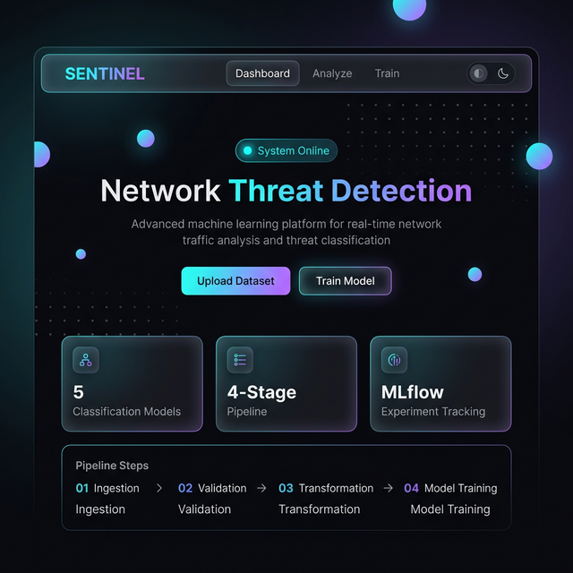
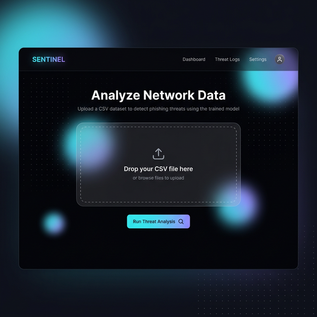

<div align="center">

# 🛡️ SENTINEL

### AI-Powered Network Threat Detection System

[](https://python.org)
[](https://fastapi.tiangolo.com)
[](https://scikit-learn.org)
[](https://mlflow.org)
[](https://mongodb.com)
[](https://docker.com)
[](https://render.com)

**An end-to-end ML pipeline that detects phishing attacks in network traffic — from raw data ingestion to real-time predictions — wrapped in a stunning, modern web interface.**

[Live Demo](#-deploy-to-render-free) · [Get Started](#-quick-start) · [API Docs](#-api-reference) · [MLflow Dashboard](https://dagshub.com/its-me-meax/networksecurity.mlflow)

---

</div>

## ✨ Preview

<div align="center">



<br/><br/>

<table>
<tr>
<td width="50%"></td>
<td width="50%">

### 🎨 Design Features
- **Glassmorphism** cards with blur effects  
- **Interactive dot-grid** animated background  
- **Gradient animations** (cyan ↔ violet)  
- **Dark / Light** theme with smooth toggle  
- **Scroll-reveal** entrance animations  
- **Drag-and-drop** CSV uploads  
- **Live pipeline** step visualization  
- **Responsive** — works on any screen  

</td>
</tr>
</table>

</div>

---

## 🧠 What It Does

Sentinel analyzes network traffic features and classifies each data point as **legitimate** or **phishing** using machine learning. The system automates the entire journey:

```
📥 Data Ingestion → ✅ Validation → 🔄 Transformation → 🤖 Training → 🎯 Prediction
```

| Feature | Description |
|---------|-------------|
| **5 ML Models** | Random Forest, Gradient Boosting, Decision Tree, Logistic Regression, AdaBoost |
| **Auto-Tuning** | Hyperparameter tuning via GridSearchCV across all models |
| **Best Model Selection** | Automatically picks the highest-scoring classifier |
| **Drift Detection** | Schema validation + feature drift reports per training run |
| **Experiment Tracking** | Every run logged to MLflow with F1, Precision, Recall metrics |
| **Web Interface** | Upload CSV → get predictions, or trigger training from the browser |
| **REST API** | Programmatic `/train` and `/predict` endpoints |

---

## 🏗️ Architecture

```
                              ┌─────────────────────────────────────────┐
                              │         SENTINEL WEB APPLICATION        │
                              │      FastAPI + Jinja2 + Sentinel UI     │
                              └──────────────┬──────────────────────────┘
                                             │
          ┌──────────────────────────────────────────────────────────────┐
          │                    ML TRAINING PIPELINE                      │
          │                                                              │
          │  ┌──────────┐   ┌──────────┐   ┌──────────┐   ┌──────────┐ │
          │  │  01 Data  │──▶│  02 Data │──▶│  03 Data │──▶│ 04 Model │ │
          │  │ Ingestion │   │Validation│   │Transform │   │ Training │ │
          │  │          │   │          │   │          │   │          │ │
          │  │ MongoDB  │   │ Schema + │   │   KNN    │   │5 Models +│ │
          │  │ → CSV    │   │  Drift   │   │ Imputer  │   │ MLflow   │ │
          │  └──────────┘   └──────────┘   └──────────┘   └──────────┘ │
          └──────────────────────────────────────────────────────────────┘
                                             │
                              ┌──────────────┴──────────────┐
                              │                             │
                         ┌────┴────┐                  ┌─────┴─────┐
                         │ MongoDB │                  │  MLflow   │
                         │  Atlas  │                  │  DagsHub  │
                         └─────────┘                  └───────────┘
```

---

## 🧰 Tech Stack

<table>
<tr>
<td>

| Layer | Technology |
|-------|-----------|
| **Language** | Python 3.10+ |
| **ML** | Scikit-learn |
| **API** | FastAPI + Uvicorn |
| **Frontend** | Jinja2, Vanilla CSS/JS |
| **Database** | MongoDB Atlas |

</td>
<td>

| Layer | Technology |
|-------|-----------|
| **Tracking** | MLflow + DagsHub |
| **Data** | Pandas, NumPy |
| **Fonts** | Inter, JetBrains Mono |
| **Container** | Docker |
| **Deploy** | Render (Free) |

</td>
</tr>
</table>

---

## 🚀 Quick Start

### Prerequisites

- **Python 3.10+** · **Git** · **MongoDB** ([Atlas Free Tier](https://mongodb.com/atlas))

### 1️⃣ Clone & Setup

```bash
git clone https://github.com/its-me-meax/networksecurity.git
cd networksecurity

python -m venv venv
# Windows
venv\Scripts\activate
# macOS / Linux
source venv/bin/activate

pip install -r requirements.txt
```

### 2️⃣ Configure Environment

Create a `.env` file in the project root:

```env
# MongoDB (required)
MONGODB_URL_KEY=mongodb+srv://<user>:<pass>@<cluster>.mongodb.net/?retryWrites=true&w=majority
MONGO_DB_URL=mongodb+srv://<user>:<pass>@<cluster>.mongodb.net/?retryWrites=true&w=majority

# MLflow / DagsHub (optional — for experiment tracking)
MLFLOW_TRACKING_URI=https://dagshub.com/<username>/networksecurity.mlflow
MLFLOW_TRACKING_USERNAME=<dagshub-username>
MLFLOW_TRACKING_PASSWORD=<dagshub-token>
```

### 3️⃣ Load Data & Run

```bash
# Seed MongoDB with the phishing dataset
python push_data.py

# Option A: Run training pipeline (CLI)
python main.py

# Option B: Launch the web app
python app.py
# → Open http://localhost:8080
```

---

## 🌐 API Reference

| Method | Endpoint | Description |
|:------:|----------|-------------|
| `GET` | `/` | 🏠 Dashboard — Sentinel landing page |
| `GET` | `/analyze` | 📊 Upload page — CSV file upload for predictions |
| `GET` | `/train-model` | 🏋️ Training page — trigger pipeline from the UI |
| `GET` | `/train` | ⚡ **API** — Runs the full training pipeline |
| `POST` | `/predict` | 🎯 **API** — Upload CSV → get phishing predictions |

### Example: Predict via cURL

```bash
curl -X POST "http://localhost:8080/predict" -F "file=@network_data.csv"
```

Returns an HTML table: each row annotated with `predicted_column` → `0` = safe, `1` = phishing.

---

## 🤖 ML Pipeline Deep Dive

### Stage 1 — Data Ingestion
> Connects to MongoDB Atlas, exports the `NetworkData` collection, and splits into **80/20 train/test sets**.

### Stage 2 — Data Validation
> Validates against `data_schema/schema.yaml`. Generates a **drift report** to detect distribution shifts between training runs.

### Stage 3 — Data Transformation
> Applies **KNN Imputer** (k=3, uniform weights) to handle missing values. Saves the fitted preprocessor as a pickle artifact.

### Stage 4 — Model Training
> Trains 5 classifiers with hyperparameter tuning, selects the best, and logs everything to MLflow:

| Model | Tuned Parameters |
|-------|-----------------|
| Random Forest | `n_estimators`: [8, 16, 32, 128, 256] |
| Decision Tree | `criterion`: [gini, entropy, log_loss] |
| Gradient Boosting | `learning_rate`, `subsample`, `n_estimators` |
| Logistic Regression | Defaults |
| AdaBoost | `learning_rate`, `n_estimators` |

**Selection criteria**: Best score · Min threshold: **0.6** · Overfit tolerance: **0.05**

---

## ☁️ Deploy to Render (Free)

Render offers a **free tier** with Docker support — zero cost, auto-deploy on push.

### Step-by-Step

1. **Push** your code to GitHub
2. **Sign up** at [render.com](https://render.com) (free)
3. Click **New → Web Service** → connect your GitHub repo
4. Configure:
   - **Build Command**: `pip install -r requirements.txt`
   - **Start Command**: `uvicorn app:app --host 0.0.0.0 --port 10000`
   - **Plan**: Free
5. Add **Environment Variables**:

   | Key | Value |
   |-----|-------|
   | `MONGODB_URL_KEY` | Your MongoDB connection string |
   | `MONGO_DB_URL` | Your MongoDB connection string |
   | `MLFLOW_TRACKING_URI` | DagsHub MLflow URL |
   | `MLFLOW_TRACKING_USERNAME` | DagsHub username |
   | `MLFLOW_TRACKING_PASSWORD` | DagsHub token |

6. Click **Create Web Service** → Done! 🎉

> **📍 Your app will be live at** `https://<app-name>.onrender.com`  
> **🔄 Auto-deploys** on every push to `main`  
> **💡 Tip**: Free tier sleeps after ~15min idle. Use [cron-job.org](https://cron-job.org) to ping every 14min to keep it awake.

---

## 🐳 Docker

```bash
# Build
docker build -t sentinel .

# Run
docker run -p 8080:8080 --env-file .env sentinel

# → http://localhost:8080
```

---

## 📊 Experiment Tracking

All runs are traced with **MLflow** via **DagsHub**:

- **Metrics**: F1 Score, Precision, Recall (train & test)
- **Model Registry**: Best model registered as `NetworkSecurityModel`
- **Dashboard**: [→ Open MLflow UI](https://dagshub.com/its-me-meax/networksecurity.mlflow)

---

## 📁 Project Structure

```
sentinel/
├── app.py                        # FastAPI web application
├── main.py                       # CLI pipeline runner
├── push_data.py                  # Seed MongoDB with CSV data
├── setup.py                      # Package config
├── requirements.txt              # Dependencies
├── dockerfile                    # Docker config
├── render.yaml                   # Render deployment blueprint
│
├── networksecurity/              # Core ML package
│   ├── components/               # Pipeline stages
│   │   ├── data_ingestion.py
│   │   ├── data_validation.py
│   │   ├── data_transformation.py
│   │   └── model_trainer.py
│   ├── pipeline/                 # Orchestration
│   │   └── training_pipeline.py
│   ├── entity/                   # Config & artifact dataclasses
│   ├── constant/                 # Hyperparameters & constants
│   ├── utils/                    # Helpers (save/load, metrics)
│   ├── exception/                # Custom exception handling
│   └── logging/                  # Logger configuration
│
├── static/                       # Frontend assets
│   ├── css/style.css             # Sentinel design system (1300+ lines)
│   └── js/dotgrid.js             # Animated dot-grid background
│
├── templates/                    # Jinja2 HTML templates
│   ├── base.html                 # Layout + navbar + theme toggle
│   ├── index.html                # Dashboard
│   ├── analyze.html              # CSV upload & prediction
│   ├── train.html                # Training trigger with live steps
│   └── table.html                # Prediction results
│
├── Network_Data/                 # Raw phishing dataset (CSV)
├── data_schema/                  # YAML schema definitions
├── assets/                       # README screenshots
└── final_model/                  # Saved model + preprocessor (.pkl)
```

---

## 🔐 Environment Variables

| Variable | Required | Description |
|----------|:--------:|-------------|
| `MONGODB_URL_KEY` | ✅ | MongoDB connection string |
| `MONGO_DB_URL` | ✅ | MongoDB connection string |
| `MLFLOW_TRACKING_URI` | ❌ | DagsHub MLflow tracking URL |
| `MLFLOW_TRACKING_USERNAME` | ❌ | DagsHub username |
| `MLFLOW_TRACKING_PASSWORD` | ❌ | DagsHub access token |

> ⚠️ **Never commit `.env`** — it's already in `.gitignore`.

---

## 🤝 Contributing

```bash
# 1. Fork the repo
# 2. Create a feature branch
git checkout -b feature/amazing-feature

# 3. Commit your changes
git commit -m "Add amazing feature"

# 4. Push & open a PR
git push origin feature/amazing-feature
```

---

## 📄 License

This project is licensed under the **MIT License** — see the [LICENSE](LICENSE) file for details.

---

<div align="center">

### Built with ❤️ by [Pradyuman Sharma](https://github.com/its-me-meax)

⭐ **Star this repo** if you found it useful!

</div>
